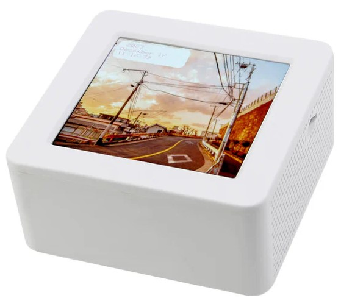
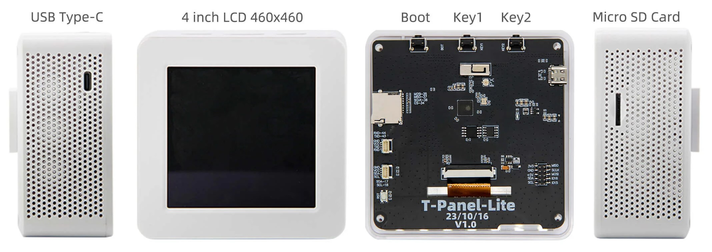

<!--
 * @Description: None
 * @version: V1.0.0
 * @Author: LILYGO_L
 * @Date: 2023-09-11 16:13:14
 * @LastEditors: Please set LastEditors
 * @LastEditTime: 2024-11-19 09:51:29
 * @License: GPL 3.0
-->
<h1 align = "center">T-Panel-Lite</h1>

    

## **English | [中文](./README_CN.md)**

## Version iteration:
| Version                              | Update date                       |
| :-------------------------------: | :-------------------------------: |
| T-Panel-Lite_V1.0                      | 2023-11-23                         |

## PurchaseLink

| Product                     | SOC           |  FLASH  |  PSRAM   | Link                   |
| :------------------------: | :-----------: |:-------: | :---------: | :------------------: |
| T-Panel-Lite_V1.0   | ESP32S3 |   16M   | 8M  | [LILYGO Mall](https://lilygo.cc/products/t-panel-s3?_pos=1&_sid=f6ce2c79c&_ss=r)   |

## Directory
- [Describe](#describe)
- [Preview](#preview)
- [Module](#module)
- [QuickStart](#quickstart)
- [PinOverview](#pinoverview)
- [FAQ](#faq)
- [Project](#project)
- [Information](#information)
- [DependentLibraries](#dependentlibraries)

## Describe

T-Panel_ Lite is a streamlined version of T-Panel,Special attention should be paid to the fact that the screen included with the T-Panel-Lite version is a non-touch version screen.

## Preview

### Actual Product Image

    

---

    

---

    

## Module

### 1.MCU Chip

* Chip: ESP32-S3
* PSRAM: 8MB
* FLASH: 16MB
* Others: For more information, please visit[Espressif Official ESP32-S3datasheet](https://www.espressif.com/sites/default/files/documentation/esp32-s3_datasheet_cn.pdf)

### 2. Screen

* Screen Model: YDP395BT001
* Size: 3.95-inch
* Resolution Ratio: 480x480px
* Screen Type: IPS
* Driver Chip: ST7701S
* Using Bus Communication Protocol: Standard SPI+RGB
* Other: Use XL95x5 IO expansion chip for Standard SPI transmission, initialize the screen, and use RGB protocol for screen color drawing

### 3. SD card slot

## QuickStart

### Examples Support

| Example | Support IDE And Version| Description | Picture |
| ------  | ------  | ------ | ------ | 
| [GFX_PDQ](./examples/GFX_PDQ) | `[Platformio IDE][espressif32-v6.5.0]` `[Arduino IDE][esp32_v2.0.14]` |  |  |
| [IIC_Scan_2](./examples/IIC_Scan_2) | `[Platformio IDE][espressif32-v6.5.0]` `[Arduino IDE][esp32_v2.0.14]` |  |  |
| [SD](./examples/SD) | `[Platformio IDE][espressif32-v6.5.0]` `[Arduino IDE][esp32_v2.0.14]` |  |  |
| [SD_MJPEG](./examples/SD_MJPEG) | `[Platformio IDE][espressif32-v6.5.0]` `[Arduino IDE][esp32_v2.0.14]` |  |  |
| [T-Panel-Lite_Test](./exampleso/T-Panel-Lite_Test) | `[Platformio IDE][espressif32-v6.5.0]` `[Arduino IDE][esp32_v2.0.14]` | Out-of-factory original test file |  |
| [Wifi](./examples/Wifi) | `[Platformio IDE][espressif32-v6.5.0]` `[Arduino IDE][esp32_v2.0.14]` |  |  |

| Firmware | Description | Picture |
| ------  | ------  | ------ |
| [T-Panel-Lite_Test](./firmware/[T-Panel-Lite_V1.0][T-Panel-Lite_Test]_firmware_V1.0.5.bin) | Out-of-factory original test file |  |

### PlatformIO
1. Install[VisualStudioCode](https://code.visualstudio.com/Download),Choose installation based on your system type.

2. Open the "Extension" section of the Visual Studio Code software sidebar(Alternatively, use "<kbd>Ctrl</kbd>+<kbd>Shift</kbd>+<kbd>X</kbd>" to open the extension),Search for the "PlatformIO IDE" extension and download it.

3. During the installation of the extension, you can go to GitHub to download the program. You can download the main branch by clicking on the "<> Code" with green text, or you can download the program versions from the "Releases" section in the sidebar.

4. After the installation of the extension is completed, open the Explorer in the sidebar(Alternatively, use "<kbd>Ctrl</kbd>+<kbd>Shift</kbd>+<kbd>E</kbd>" go open it),Click on "Open Folder," locate the project code you just downloaded (the entire folder), and click "Add." At this point, the project files will be added to your workspace.

5. Open the "platformio.ini" file in the project folder (PlatformIO will automatically open the "platformio.ini" file corresponding to the added folder). Under the "[platformio]" section, uncomment and select the example program you want to burn (it should start with "default_envs = xxx") Then click "<kbd>[√](image/4.png)</kbd>" in the bottom left corner to compile,If the compilation is correct, connect the microcontroller to the computer and click "<kbd>[→](image/5.png)</kbd>" in the bottom left corner to download the program.

### Arduino
1. Install[Arduino](https://www.arduino.cc/en/software),Choose installation based on your system type.

2. Open the "example" directory within the project folder, select the example project folder, and open the file ending with ".ino" to open the Arduino IDE project workspace.

3. Open the "Tools" menu at the top right -> Select "Board" -> "Board Manager." Find or search for "esp32" and download the board files from the author named "Espressif Systems." Then, go back to the "Board" menu and select the development board type under "ESP32 Arduino." The selected development board type should match the one specified in the "platformio.ini" file under the [env] section with the header "board = xxx." If there is no corresponding development board, you may need to manually add the development board from the "board" directory within your project folder.

4. Open menu bar "[File](image/6.png)" -> "[Preferences](image/6.png)" ,Find "[Sketchbook location](image/7.png)"  here,copy and paste all library files and folders from the "libraries" folder in the project directory into the "libraries" folder in this directory.

5. Select the correct settings in the Tools menu, as shown in the table below.

| Setting                               | Value                                 |
| :-------------------------------: | :-------------------------------: |
| Board                                | ESP32S3 Dev Module            |
| Upload Speed                     | 921600                               |
| USB Mode                           | Hardware CDC and JTAG     |
| USB CDC On Boot                | Enabled                             |
| USB Firmware MSC On Boot | Disabled                             |
| USB DFU On Boot                | Disabled                             |
| CPU Frequency                   | 240MHz (WiFi)                    |
| Flash Mode                         | QIO 80MHz                         |
| Flash Size                           | 16MB (128Mb)                     |
| Core Debug Level                | None                                 |
| Partition Scheme                | 16M Flash (3MB APP/9.9MB FATFS) |
| PSRAM                                | QSPI PSRAM                         |
| Arduino Runs On                  | Core 1                               |
| Events Run On                     | Core 1                               |

6. Select the correct port.

7. Click "<kbd>[√](image/8.png)</kbd>" in the upper right corner to compile,If the compilation is correct, connect the microcontroller to the computer,Click "<kbd>[→](image/9.png)</kbd>" in the upper right corner to download.

### firmware download
1. Open the project file "tools" and locate the ESP32 burning tool. Open it.

2. Select the correct burning chip and burning method, then click "OK." As shown in the picture, follow steps 1->2->3->4->5 to burn the program. If the burning is not successful, press and hold the "BOOT-0" button and then download and burn again.

3. Burn the file in the root directory of the project file "[firmware](./firmware/)" file,There is a description of the firmware file version inside, just choose the appropriate version to download.

    
    

## PinOverview

| Display Pin       | ESP32S3 Pin   |
| :------------------: | :------------------:|
| VSYNC              | IO40       |
| HSYNC              | IO39       |
| PCLK                | IO41      |
| B0                    | IO1     |
| B1                    | IO2     |
| B2                    | IO3     |
| B3                    | IO4     |
| B4                    | IO5     |
| G0                    | IO6     |
| G1                    | IO7     |
| G2                    | IO8     |
| G3                    | IO9     |
| G4                    | IO10    |
| G5                    | IO11    |
| R0                    | IO12    |
| R1                    | IO13    |
| R2                    | IO42    |
| R3                    | IO46    |
| R4                    | IO45    |
| BL                    | IO14    |
| CS                    |        IO14         |
| SCLK                |         IO36         |
| MOSI                |         IO35         |

| SD Pin           | ESP32S3 Pin      |
| :------------------: | :------------------:|
| CS                     | IO34                  |
| SCLK                  | IO36                    |
| MOSI                  | IO35                  |
| MISO                  | IO37                    |

| KEY Pin          | ESP32S3 Pin      |
| :------------------: | :------------------:|
| KEY1                     | IO48                 |
| KEY2                  | IO47                    |
| BOOT                  | IO0                  |

## FAQ

* Q. After reading the above tutorials, I still don't know how to build a programming environment. What should I do?
* A. If you still don't understand how to build an environment after reading the above tutorials, you can refer to the [LilyGo-Document](https://github.com/Xinyuan-LilyGO/LilyGo-Document) document instructions to build it.

 

* Q. Why does Arduino IDE prompt me to update library files when I open it? Should I update them or not?
* A. Choose not to update library files. Different versions of library files may not be mutually compatible, so it is not recommended to update library files.

 

* Q. Why is there no serial data output on the "Uart" interface on my board? Is it defective and unusable?
* A. The default project configuration uses the USB interface as Uart0 serial output for debugging purposes. The "Uart" interface is connected to Uart0, so it won't output any data without configuration. For PlatformIO users, please open the project file "platformio.ini" and modify the option under "build_flags = xxx" from "-D ARDUINO_USB_CDC_ON_BOOT=true" to "-D ARDUINO_USB_CDC_ON_BOOT=false" to enable external "Uart" interface. For Arduino users, open the "Tools" menu and select "USB CDC On Boot: Disabled" to enable the external "Uart" interface.

 

* Q. Why is my board continuously failing to download the program?
* A. Please hold down the "BOOT-0" button and try downloading the program again.

## Project
* [T-Panel-Lite_V1.0](./project/T-Panel-Lite_V1.0.pdf)

## Information
* [Espressif](https://www.espressif.com/en/support/documents/technical-documents)
* [YDP395BT001-V2](./information/YDP395BT001-V2.pdf)
* [ST7701S_SPEC_V1.4](./information/ST7701S_SPEC_V1.4.pdf)

## DependentLibraries
* [Arduino_GFX-1.3.7](https://github.com/moononournation/Arduino_GFX)
* [TouchLib](https://github.com/mmMicky/TouchLib)
* [JPEGDEC-1.2.8](https://github.com/bitbank2/JPEGDEC)
* [MiniTV](https://github.com/moononournation/MiniTV)